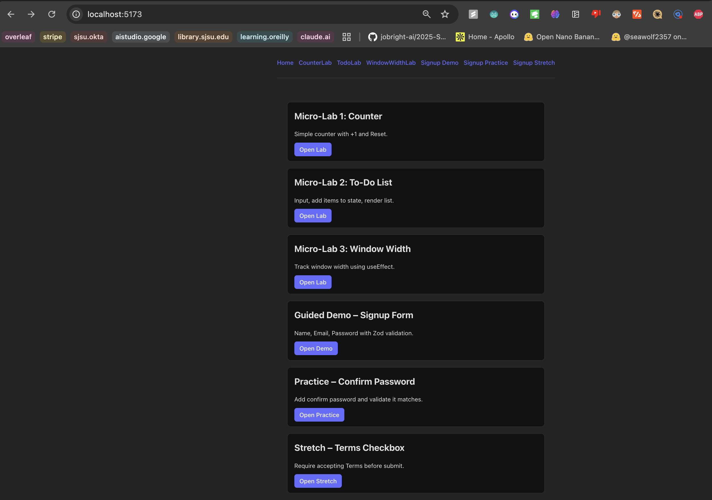
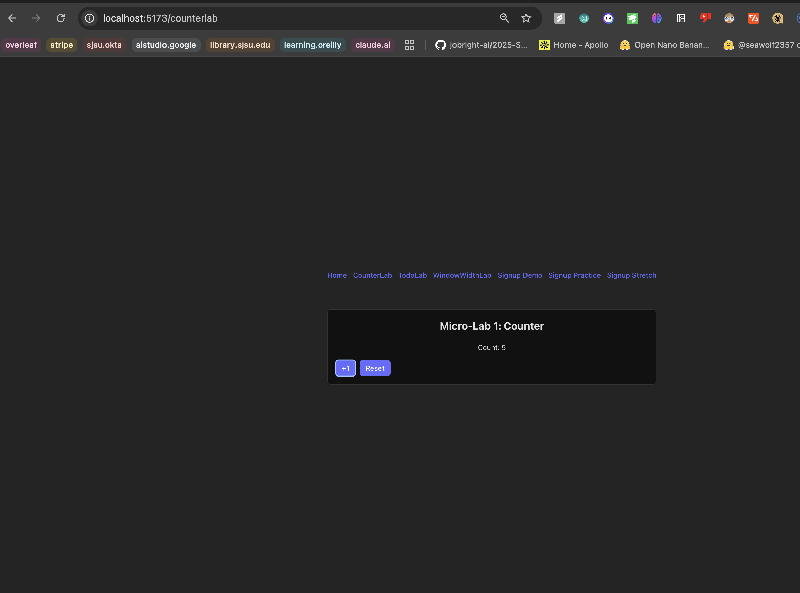
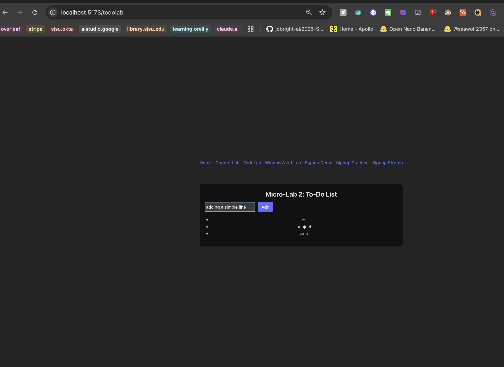
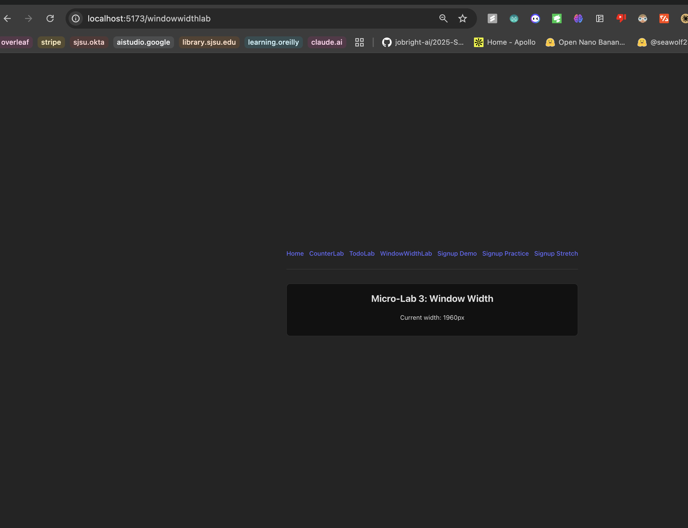
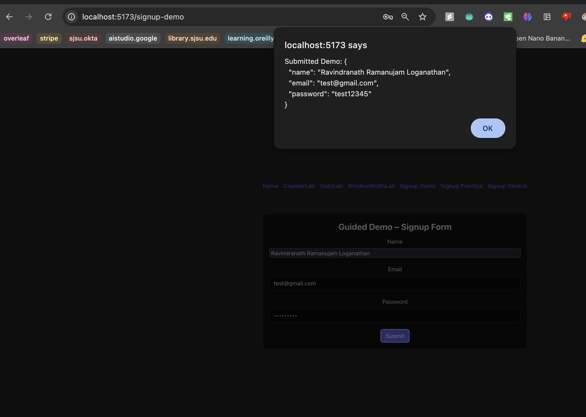
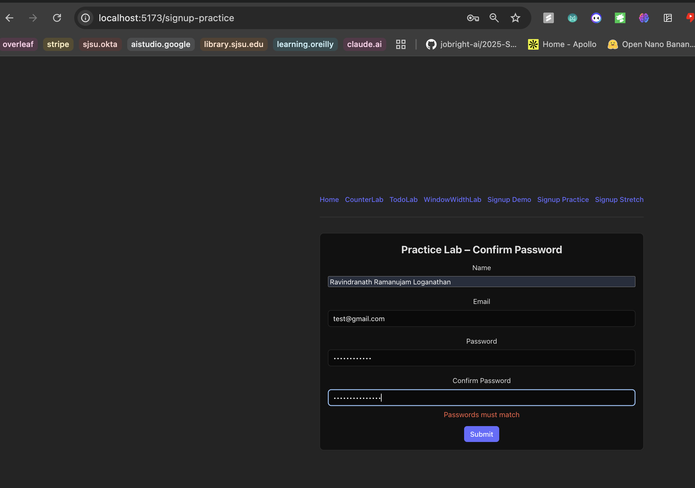
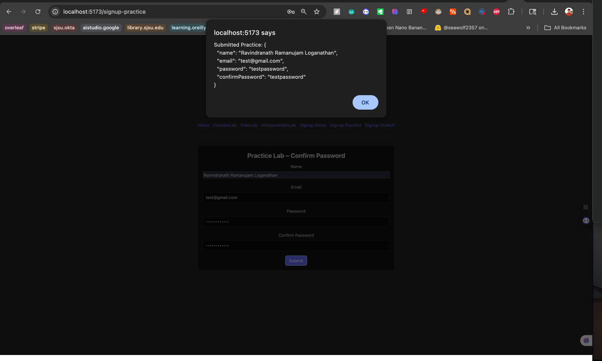
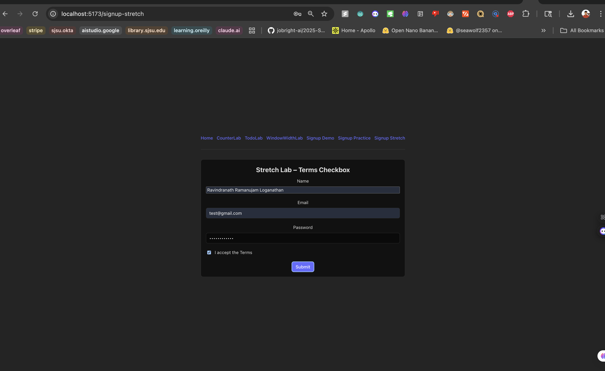

# CMPE 280 – Web UI Design – Week 7 Labs

This project contains three Micro-Labs and a Signup Form lab set (Guided Demo, Practice, Stretch), implemented with React + Vite, React Router, React Hook Form, and Zod.

## Getting Started

```bash
npm install
npm run dev
```

Open the app and use the top navigation or visit the routes directly.

## Routes

- `/` – Home (links to all labs)
- `/counterlab` – Micro-Lab 1: Counter
- `/todolab` – Micro-Lab 2: To-Do List
- `/windowwidthlab` – Micro-Lab 3: Window Width
- `/signup-demo` – Guided Demo: Signup Form
- `/signup-practice` – Practice: Confirm Password
- `/signup-stretch` – Stretch: Terms Checkbox

## Main Page

The Home page presents a simple list of cards for each lab and demo with short descriptions and buttons that navigate to the corresponding route.



## Micro-Labs

### Micro-Lab 1 – Counter
Implements a counter with +1 and Reset.

```startLine:endLine:src/CounterLab.jsx
// Micro-Lab 1 - Counter
```



### Micro-Lab 2 – To-Do List
Input + button to add items to array state and render the list.

```startLine:endLine:src/TodoLab.jsx
// Micro-Lab 2 - To-Do List
```



### Micro-Lab 3 – Window Width
Tracks window width using `useEffect`.

```startLine:endLine:src/WindowWidthLab.jsx
// Micro-Lab 3 - Window Width Tracker
```



## Signup Form Labs

All forms use React Hook Form with Zod validation. Shared components (`Section`, `FormField`) provide consistent UI across pages.

### Guided Demo – Signup Form
Fields: Name, Email, Password. Validates email format and minimum password length.

```startLine:endLine:src/SignupFormDemo.jsx
// Guided Demo – Signup Form
```



### Practice – Confirm Password
Adds `confirmPassword` and validates it matches `password` using a schema refinement.

Refinement logic:
```js
schema.refine((d) => d.password === d.confirmPassword, { path: ['confirmPassword'], message: 'Passwords must match' })
```

```startLine:endLine:src/SignupFormPracticeConfirm.jsx
// Practice Lab – Confirm Password
```

Screenshots:





### Stretch – Terms Checkbox
Requires accepting Terms. Submit button is disabled until `terms` is checked, and the schema enforces `terms` is true.

Schema:
```js
terms: z.literal(true, { message: 'Must accept Terms' })
```

```startLine:endLine:src/SignupFormStretchTerms.jsx
// Stretch Lab – Terms Checkbox
```



## Accessibility Notes

Each form field sets `aria-describedby` to associate errors with inputs, and visible error text is rendered using a shared `FormField` component.

## Shared UI

- Styles: `src/ui.css`
- Components: `src/components/Section.jsx`, `src/components/FormField.jsx`

